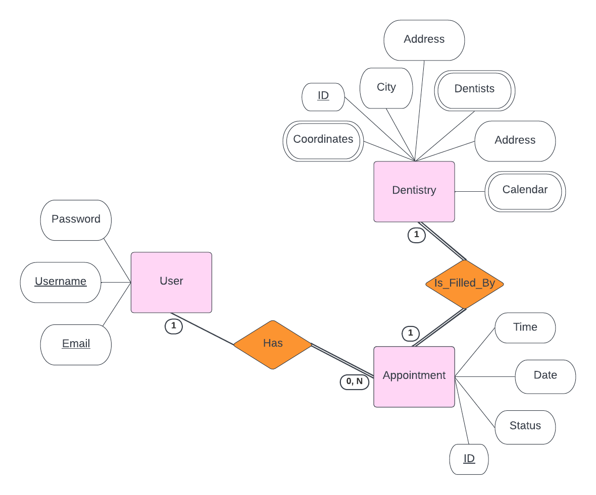

# Welcome to Dentistimo Project!

## DIT356 Mini Project: Distributed Systems

 

 

# Team members

Oscar Reina Gustafsson

Aditya Khadkikar

Anton Golubenko 

Kwabena Asare Boström

 

## Find dental care close to you

Our platform brings together the best affordable dental care in your area. With a single click you can now book your chosen dentist at your convenience. If you can feel it in your tooth it's time to visit us at dentistimo.com. Whether you're looking to redesign your smile or to fix an annoying cavity, Dentistimo is the solution for you. As simple to use as saying "Ouch!"

 

# Conceptual design

This system is a distributed system with a presentation layer that communicates with its subsystems via a broker and a gateway. The Gateway in question is used to act as both a type of validator and a filter for the data in the messages sent. Each subsystems are independent and have no coupling to one another which is the intention for the system to achieve easy scalability through modularization with the subsystem modules.

 

# Architectural styles

The system will be event driven, using the publish/subscribe model. This means that in short, there will be event producers publishing messages to a topic to which one or mupltiple consumers are subscribed to. These consumers are independent of each other and are only subscribed to the necessary topics. A broker is implemented to act as a middle man between the producers and consumers. The broker keeps track of which subsystem is subscribed to what topic. This style is well-suited for a distributed system where multiple subsystems have to process the same event. It also allows for real-time processing and better performance. Horizontal expansion of this system is also easily achived using this style.

 

# Conceptual design mapping

Our system consists of frontend and backend subsystems, in which messages to and from the subsystems are sent over MQTT using publish/subscribe to transfer the data, and get filtered through a gateway. Once the required filtering and processing has occurred, the subsystem that requested data to be processed will handle the data.

 

# UI Figma Design

First version of the UI design of the website:

https://www.figma.com/file/DbQ2tJqaqLWSSC0dJo13Oq/Frontend-V1?node-id=0%3A1&t=qZZ8B5Cm3Sd5hl0i-1  

 

# Burndown Charts

 

# Project Design

## Functional Decomposition

## Components Diagram

## ER Diagram

## Use Case Diagram

## Sequence Diagram

## Install
## Run 

## Technologies
- Node js 
- React 
- MQTT
- Google Map 
- Mongo DB
## Links to the other distributed system's nodes

- Availability Checker  [https://github.com/TheRealKwabena/T2-availability-checker]
- Appointment Handler  [https://github.com/TheRealKwabena/T2-Appointment-Handler]
- User Interface  [https://github.com/TheRealKwabena/T2-User-Interface]
- Authentication Handler  [https://github.com/TheRealKwabena/T2-Authentication-Handler]

## Licensing

